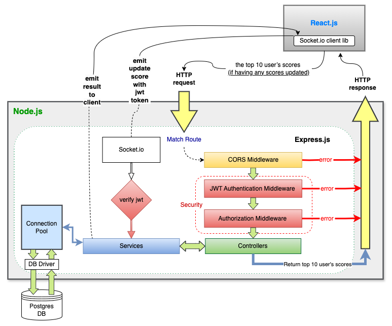

## Overview
This module facilitates the management of user scores in the application. It includes functionalities to update user scores, ensure authorization and authentication, and provide real-time updates to the scoreboard on the website.
## Software Requirements
- Scoreboard Display: The website displays the top 10 user scores.
- Real-time Updates: The scoreboard is updated in real-time.
- Score Increment: User actions trigger score increments.
- API Integration: Upon action completion, an API call is dispatched to the application server to update the score.
- Authorization: Malicious users are prevented from increasing scores without proper authorization.
## Technology Stack
- Node >= 18.18.2
- Express.js: Backend framework for handling HTTP requests.
- JWT (JSON Web Tokens): For user authentication and authorization.
- Websocket (Socket.io): Facilitates real-time communication between the server and client.
- Postgres: Database for storing user scores.
- Pg: pg-pool for Node.js to connect to PostgresDB.
- TypeScript: Typed superset of JavaScript.
## Flow Scenario
#### UPDATE (socket.io event)
1. Client-Server Interaction: React client communicates with Express backend via Socket.io for real-time updates.
2. Score Update Dispatch: Upon completing an action, the client emits a message to the Socket server.
3. JWT Verification: The Socket server verifies the JWT in the message to prevent unauthorized score updates.
4. Business Logic: If verification is successful, the service executes business logic to update the database using a pooling connection.
5. Scoreboard Update: After updating the score, the Socket server emits a message to the client to fetch the updated top 10 scores.
#### GET (api endpoint)
    Endpoint: /api/score/top
    Method: GET
    Response: Returns the top 10 users with the highest scores, along with their respective scores.
1. API Endpoint Invocation: The client calls an API endpoint to retrieve the top 10 user scores.
2. Request Handling: The request passes through middleware layers including CORS, JWT authentication, and authorization before reaching the controller.
3. Controller Handling: The controller processes the request, invokes services to handle business logic, and fetches user scores.
4. Response Delivery: Upon successful processing, the server returns the data to the client.
## Flow of Execution
### Diagram
 
 
Whatever action done to trigger this Emit to update the score:

1. Client Emit: the React client emits a message to the Socket server to trigger score update.
2. JWT Verification: Socket server verifies the JWT to ensure authorization.
3. Business Logic Execution: Upon successful verification, the service updates the database with the new score.
4. Scoreboard Update Emit: Socket server emits a message to the client to inform that the Database has updated.

The React client will call api to get the scoreboard after updating the score:

6. API GET Request: Client makes an API GET request to retrieve the top 10 user scores.
7. Request Processing: The request passes through middleware layers for authentication and authorization.
8. Controller Handling: Controller processes the request, invokes services, and fetches user scores.
9. Response Delivery: Server returns the data to the client upon successful processing.

### Note
Ensure that error handling mechanisms are in place at each step of the flow.
Implement logging to track score updates and API requests for debugging and auditing purposes.
Consider implementing rate limiting or other security measures to prevent abuse or misuse of the API endpoints.
Provide comprehensive documentation for API endpoints, including request and response formats, authentication requirements, and error codes.

